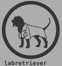

<!-- README.md is generated from README.Rmd. Please edit that file -->

# labretriever <a href=''></a>

<!-- badges: start -->

[](https://github.com/cmatKhan/labretriever/actions/workflows/R-CMD-check.yaml)
[](https://app.codecov.io/gh/cmatKhan/labretriever?branch=main)
<!-- badges: end -->

The goal of labretriever is to …

## Installation

You can install the development version of labretriever like so:

``` r
devtools::install_github('https://github.com/cmatKhan/labretriever.git')
```

## Usage

There are three main objects in the public API:

``` r
library(labretriever)

# Get documentation on configured endpoints
?labretriever::database_info

# Documentation on retrieving data from the endpoints
?labretriever::retrieve()

# Documentation on 
?labretriever::send()
```

## Configuring labretriever

Given some API requirements, configuring labretriever for use with a
different set of endpoints simply means overwriting the `database_info`.

More details on the API expectations may be found in the
[documentation](https://cmatkhan.github.io/labretriever/)
